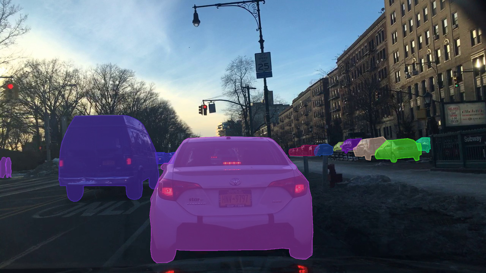

# BDD100k Instance Segmentation with Mask R-CNN

This is a final project for a masters in data science at the University of Denver. Instance Segmentation with Berkeley DeepDrive dataset using [Mask R-CNN](https://arxiv.org/abs/1703.06870) on Python 3, Keras, and TensorFlow. The model generates bounding boxes and segmentation masks for each instance of an object in the image. It's based on Feature Pyramid Network (FPN) and a ResNet50 backbone.

# Getting Started
* [eda.ipynb](samples/bdd100k/1._Exploratory_Data_Analysis.ipynb) shows some statistical analysis on the bdd100k ins seg dataset. 

* [data_inspect.ipynb](samples/bdd100k/2._Data_Inspection.ipynb) shows inspection of the BDD100k dataset and Mask R-CNN model. 

* [model_training.ipynb](samples/bd100k/3._Model_Training.ipynb) It shows the Berkeley DeepDrive dataset trained for instance segmentation with Mask R-CNN

* [data_inspect.ipynb](samples/bdd100k/4._Model_Evaluation.ipynb) shows evaluation of the Mask R-CNN model on the BDD100k dataset.

## Requirements
Python 3.4, TensorFlow 1.3, Keras 2.0.8 and other common packages listed in `requirements.txt`.

